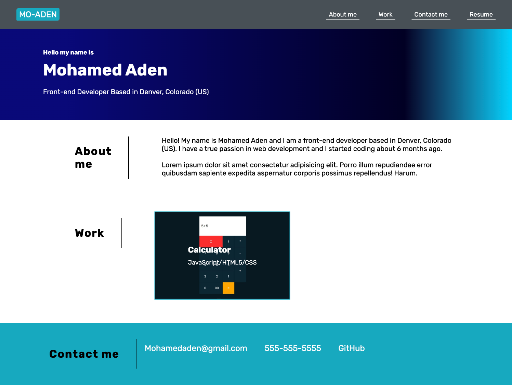

# AdvancedHTMLCSS-Portfolio

<h3>This project was completed with the use of advanced HTML and CSS</h3>
<ul>
  <li>
    I posted one project that I will be completing this friday, 10/28/2022
  </li>
  <li>This is a responsive page and can be used in any viewport</li>
</ul>

